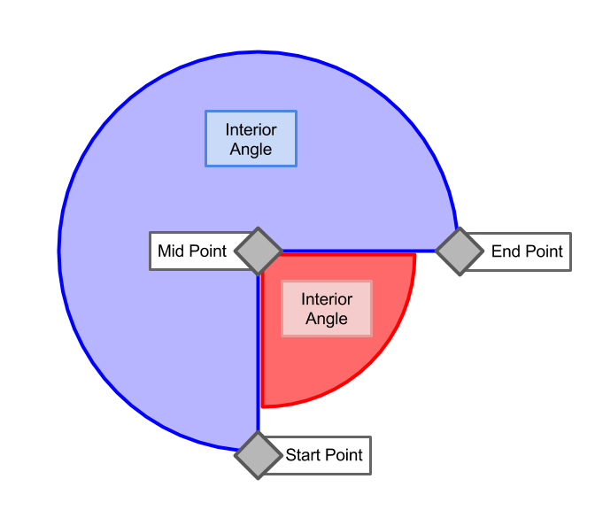

# @turf/angle

<!-- Generated by documentation.js. Update this documentation by updating the source code. -->

## angle

Finds the angle formed by two adjacent segments defined by 3 points. The result will be the (positive clockwise)
angle with origin on the `startPoint-midPoint` segment, or its explementary angle if required.

### Parameters

*   `startPoint` **[Coord][1]** Start Point Coordinates
*   `midPoint` **[Coord][1]** Mid Point Coordinates
*   `endPoint` **[Coord][1]** End Point Coordinates
*   `options` **[Object][2]** Optional parameters (optional, default `{}`)

    *   `options.explementary` **[boolean][3]** Returns the explementary angle instead (360 - angle) (optional, default `false`)
    *   `options.mercator` **[boolean][3]** if calculations should be performed over Mercator or WGS84 projection (optional, default `false`)

### Examples

```javascript
turf.angle([5, 5], [5, 6], [3, 4]);
//=45
```

Returns **[number][4]** Angle between the provided points, or its explementary.

[1]: https://tools.ietf.org/html/rfc7946#section-3.1.1

[2]: https://developer.mozilla.org/docs/Web/JavaScript/Reference/Global_Objects/Object

[3]: https://developer.mozilla.org/docs/Web/JavaScript/Reference/Global_Objects/Boolean

[4]: https://developer.mozilla.org/docs/Web/JavaScript/Reference/Global_Objects/Number

<!-- This file is automatically generated. Please don't edit it directly. If you find an error, edit the source file of the module in question (likely index.js or index.ts), and re-run "yarn docs" from the root of the turf project. -->

---

This module is part of the [Turfjs project](https://turfjs.org/), an open source module collection dedicated to geographic algorithms. It is maintained in the [Turfjs/turf](https://github.com/Turfjs/turf) repository, where you can create PRs and issues.

### Installation

Install this single module individually:

```sh
$ npm install @turf/angle
```

Or install the all-encompassing @turf/turf module that includes all modules as functions:

```sh
$ npm install @turf/turf
```


### Diagrams

